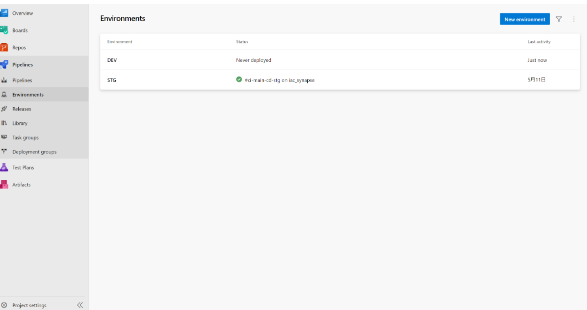

# SynapseCICD-template-workspace

## How to use

### Prerequisite

Set up 

- Dev/Stg Synapse Resources
- DevOps Service Connections
- Permission setting
 
### Step by step guide

1. Basical set up.

    - Create Dev/Stg Synapse Resources
    - Create DevOps Service Connectionn
    - Setup Permission setting.

reference: https://techcommunity.microsoft.com/t5/data-architecture-blog/ci-cd-in-azure-synapse-analytics-part-4-the-release-pipeline/ba-p/2034434

2. Create **STG** Environment in devops

3. Clone this repositry to Azure DevOps Repos
4. Configuration Synapse Analytics Git integration.
5. Prep TemplateParametersForWorkspace_stg.json
6. Create and run DevOps pipeline 
   1. CI/CD flow in same pipline
       - [azure-pipelines-ci-cd-synapse-artifacts.yml](.ado\azure-pipelines-ci-cd-synapse-artifacts.yml) 
   2. Separete CI/CD
       - [azure-pipelines-ci-synapse-artifacts.yml](.ado\azure-pipelines-ci-synapse-artifacts.yml)
       - [azure-pipelines-cd-synapse-artifacts.yml](.ado\azure-pipelines-cd-synapse-artifacts.yml)
